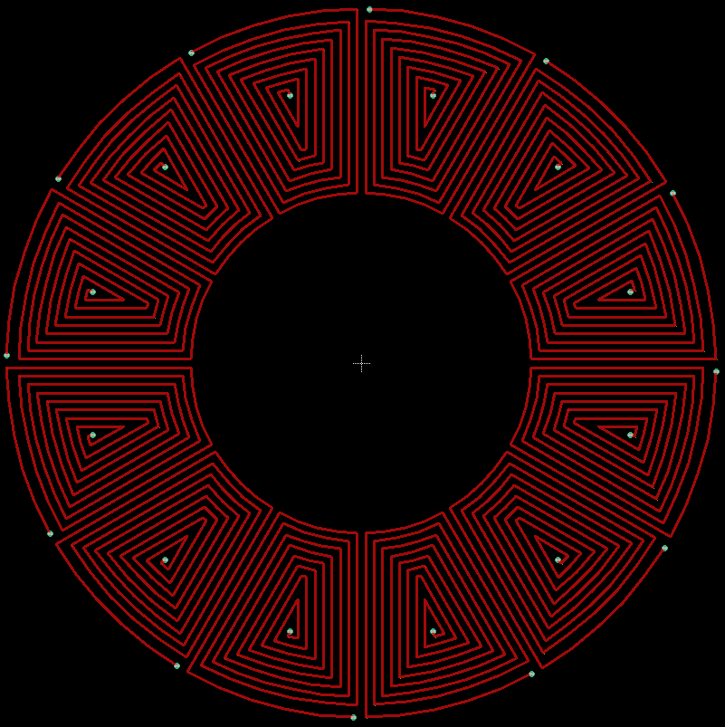

<!-- TABLE OF CONTENTS -->

  
Table of Contents

  <ol>
    <li><a href="#EAGLE">EAGLE</a></li>
    <li><a href="#ULP">ULP</a></li>
    <li><a href="#Installation">Installation</a></li>
    <li><a href="#Usage">Usage</a></li>
    <li><a href="#Close-up-of-a-single-coil">Close up of a single coil</a></li>
    <li><a href="#Some-examples">Some examples</a></li>
    <li><a href="#Known-issues">Known issues</a></li>
  </ol>

## EAGLE  <a name="EAGLE"/>

**E**asily **A**pplicable **G**raphical **L**ayout **E**ditor is a PCB design and electrical schematic software.

## ULP  <a name="ULP"/>
User Language Programs (ULP) are scripts that are run from within EAGLE to accomplish tasks that would be tedious to do by hand or have to be repeated frequently.

## Installation <a name="Installation"/>
**Option 1:** 
Place the file "WedgeShapedCoils.ulp" anywhere and navigate to it via file selection dialog box 

**Option 2:** 
Put the ULP-file in the folder with all the other ULP inside the EAGLE installation in $EAGLE_INSTALL_DIRECTORY$\examples\ulps\examples

**Option 3:** 
Put the ULP-file in the folder with all the other ULP inside the user directory in $USER$\Documents\EAGLE\ulps

## Usage  <a name="Usage"/>
Launch the script inside EAGLE via the ULP Button.

 
 

Select the installation path (1) and select the ULP from the list or navigate to the script via the browse option (2) 

 
 

Input the desired parameters in the UI. 

 
 

Confirm the pop-up with the number of windigs.  

 
 

Wait for EAGLE to draw the coils. 

 

Done!

## Close up of a single coil  <a name="Close-up-of-a-single-coil"/>

## Some examples  <a name="Some-examples"/>

## Known issues <a name="Known-issues"/>
### #1
During DRC you get a bunch of Airwire errors.

Some wires between 'Arcs' and 'Wires' aren't connecting properly.
I've created a [thread](https://forums.autodesk.com/t5/eagle-forum/wires-not-connecting-with-command-line-function-calls/td-p/9889741 "thread") in the EAGLE Forum but no replies. I've contacted the support - no reply either. ¯\_(ツ)_/¯

I didn't have any problems creating CAD-files and PCBs since the wires overlap more than enough.
